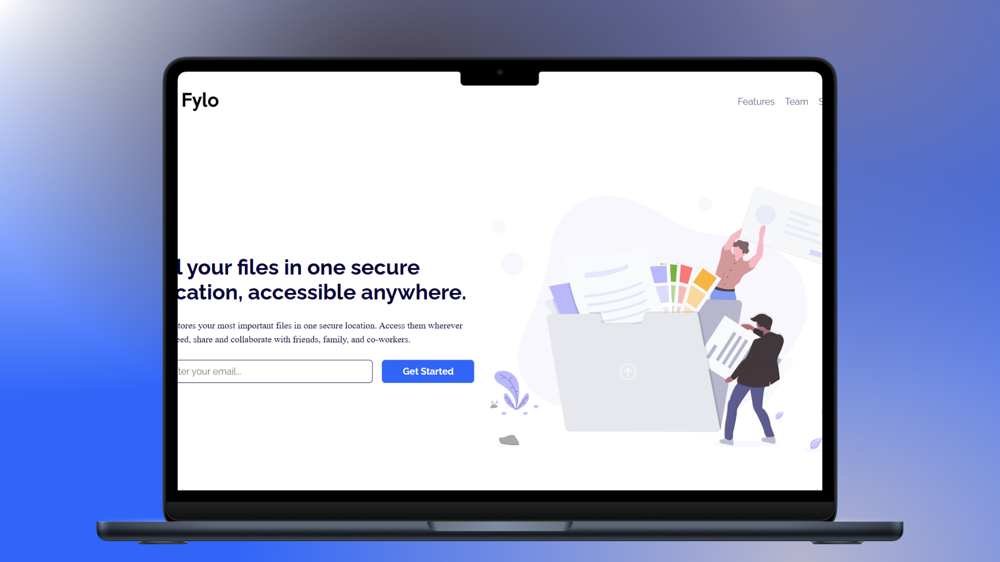

<h1 align="center">Fylo Landing Page — Two Column Layout 🌐</h1>

<p align="left">
  <a href="README_ES.md" target="_blank">
    Ver README en Español
  </a>
</p>

<p>This repository contains my implementation of the "Fylo Landing Page with Two Column Layout" challenge by Frontend Mentor. The purpose of this project was to enhance my skills in HTML, CSS, and Flexbox by building a responsive landing page. I focused on using semantic HTML and efficient Flexbox structures to create a visually appealing and adaptable layout.</p>
<hr>

<h1 align="center">Technologies Used</h1>
<div align="center">
  
  
</div>
<hr>

<h1 align="center">Objective</h1>
<ul>
  <li>Practice building responsive layouts using <b>Flexbox</b>.</li>
  <li>Improve structuring using <b>semantic HTML</b>.</li>
  <li>Apply clean and maintainable <b>CSS styling</b>.</li>
</ul>
<hr>

<h1 align="center">Main Features</h1>
<ul>
  <li><b>Responsive Design:</b> Seamless adaptation to different screen sizes using Flexbox.</li>
  <li><b>Semantic HTML:</b> Clean markup that reflects the structure and content accurately.</li>
  <li><b>Minimalistic Layout:</b> Clean and readable two-column design for better user experience.</li>
</ul>
<hr>

<h1 align="center">Skills Acquired</h1>
<ul>
  <li>Strengthened understanding of Flexbox layout strategies.</li>
  <li>Efficient use of semantic HTML elements.</li>
  <li>Creation of responsive designs with a focus on accessibility and readability.</li>
</ul>
<hr>

<h1 align="center">How to Use</h1>

1. Clone this repository to your local machine:
   ```sh
   git clone https://github.com/jordanmedinaortiz/FyloLandingPageWithTwoColumnLayout.git
   cd fylo-landing-page-with-two-column-layout
2. Open the project
   <ul>
     <li>Navigate to the folder and open <code>index.html</code> in your preferred browser.</li>
     <li>Explore the layout and inspect the Flexbox-based structure.</li>
   </ul>
<p>You can view a live demo of the project <a href="https://jordanmedinaortiz.github.io/fylo-landing-page-with-two-column-layout/">here</a>.</p>

