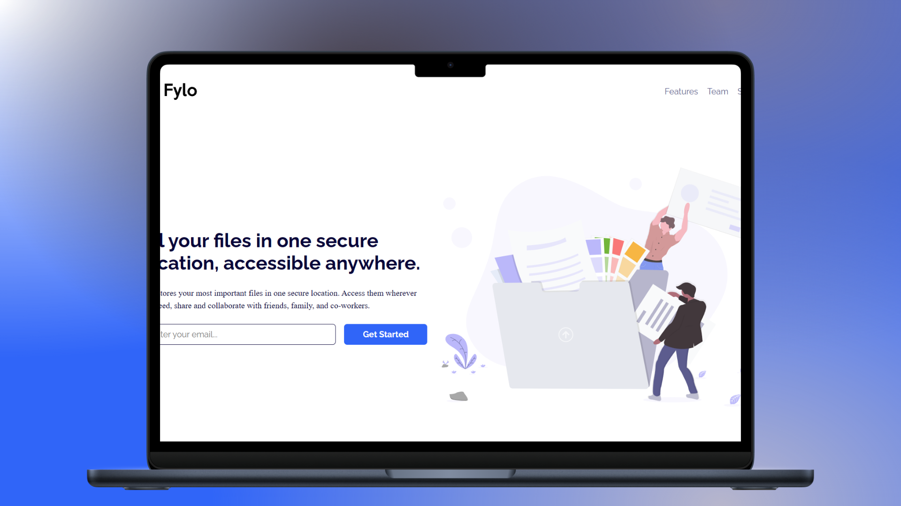

<h1 align="center">Fylo Landing Page — Diseño de Dos Columnas 🌐</h1>

<p align="left">
  <a href="README.md" target="_blank">
    View README in English
  </a>
</p>

<p>Este repositorio contiene mi implementación del reto "Fylo Landing Page with Two Column Layout" de Frontend Mentor. El propósito de este proyecto fue mejorar mis habilidades en HTML, CSS y Flexbox creando una página de aterrizaje responsiva. Me enfoqué en utilizar HTML semántico y estructuras eficientes con Flexbox para lograr un diseño visualmente atractivo y adaptable.</p>
<hr>

<h1 align="center">Tecnologías Utilizadas</h1>
<div align="center">
  
  
</div>
<hr>

<h1 align="center">Objetivo</h1>
<ul>
  <li>Practicar la creación de diseños responsivos usando <b>Flexbox</b>.</li>
  <li>Mejorar la estructuración mediante <b>HTML semántico</b>.</li>
  <li>Aplicar estilos en CSS de forma limpia y mantenible.</li>
</ul>
<hr>

<h1 align="center">Características Principales</h1>
<ul>
  <li><b>Diseño Responsivo:</b> Adaptación fluida a diferentes tamaños de pantalla usando Flexbox.</li>
  <li><b>HTML Semántico:</b> Marcado limpio que refleja con precisión la estructura y el contenido.</li>
  <li><b>Diseño Minimalista:</b> Distribución en dos columnas clara y legible para una mejor experiencia de usuario.</li>
</ul>
<hr>

<h1 align="center">Aprendizajes Adquiridos</h1>
<ul>
  <li>Fortalecimiento del uso de Flexbox en el diseño de interfaces.</li>
  <li>Uso eficiente de elementos HTML semánticos.</li>
  <li>Creación de diseños responsivos centrados en la accesibilidad y legibilidad.</li>
</ul>
<hr>

<h1 align="center">Instrucciones de Uso</h1>

1. Clona este repositorio a tu máquina local:
   ```sh
   git clone https://github.com/jordanmedinaortiz/fylo-landing-page-with-two-column-layout.git
   cd fylo-landing-page-with-two-column-layout
2. Abre el proyecto
<ul>
  <li>Navega a la carpeta y abre <code>index.html</code> en tu navegador web preferido.</li>
  <li>Explora el diseño e inspecciona la estructura basada en Flexbox.</li>
</ul>
<p>Puedes ver una demostración en vivo del proyecto <a href="https://jordanmedinaortiz.github.io/fylo-landing-page-with-two-column-layout/">aquí</a>.</p>

